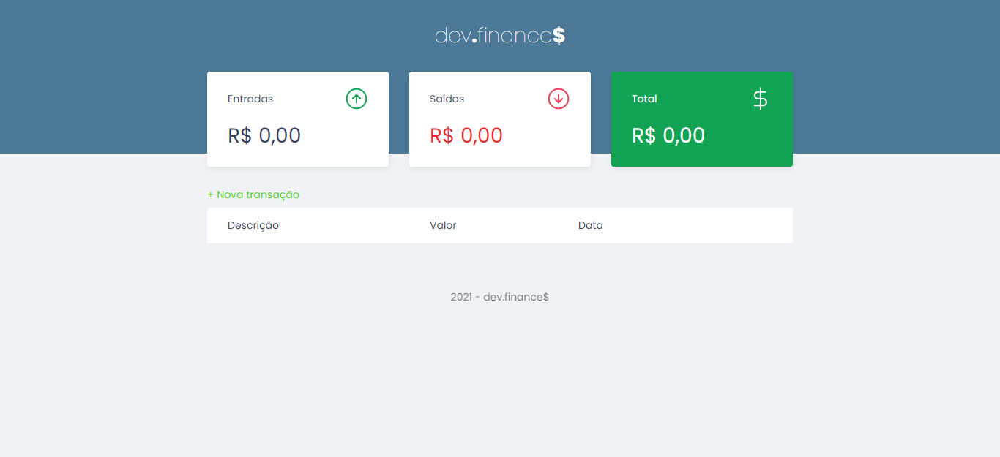
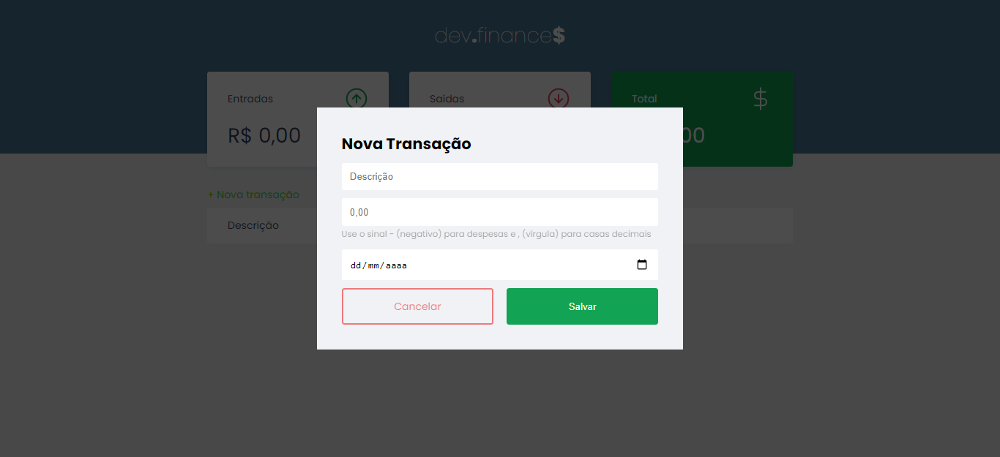
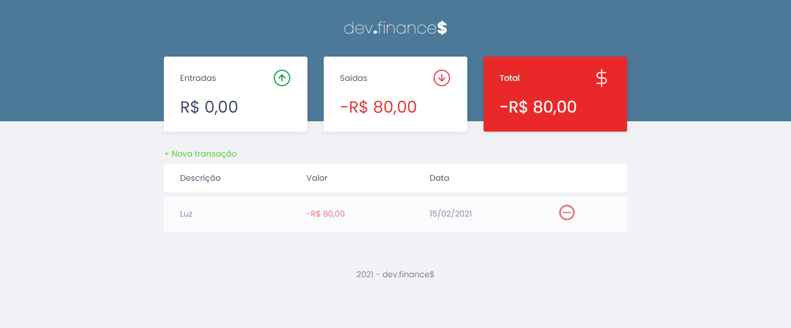
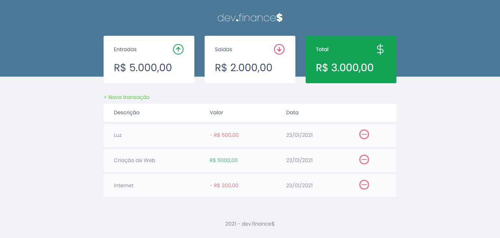

# Maratona Discover

See Online: [dev.finance$](http://devfinance.gearhostpreview.com/) 
Marathon HTML, CSS and Javascript

## About Project

In this project, we build a simple personal finance manager using HTML, CSS and Javascript.

## Techs

- HTML - we explore semantic tags like header, main, section and footer;
- CSS - we using features like varibles for colors, display flex, display grid and some ticks, for example an trick css to hidden element but visible to screen readers.
- Javascript - DOM manipulation, objects, arrow functions, and localstorage to save datas.

## Screenshots

### Initial View

### Add Transactions

### Negative balance

### Positive balance

## Author

[Davi Silva - Linkedin](https://www.linkedin.com/in/davisilva85/)
